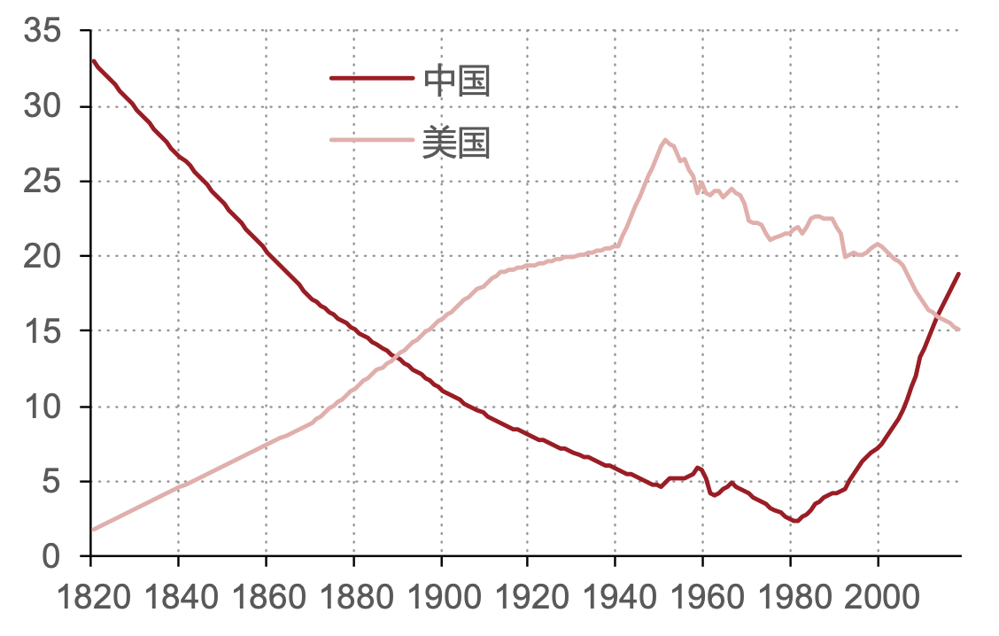

# 有关中国经济的关键问题

对应《宏观经济学二十五讲：中国视角》前言、第一讲
{: align="right" }

## 四个有关中国经济的关键问题

{: align=right width=600}

### 有关经济增长

- 为什么人还是那些人、资源还是那些资源，中国经济增长的绩效在改革开放前后如此截然不同？
- 中国经济增长的源泉在哪里，障碍在哪里？
- 中国经济还能高速增长多久？
- 中国会落入“中等收入陷阱”吗？
- 为了尽可能长地延续高增长，应该采用什么样的政策？

### 有关经济波动

- 经济为什么会波动？
- 经济波动会摧毁经济么？
- 什么样的政策可以平滑波动？
- 我们应该试图平滑经济波动么？
- 中国经济的波动为什么在次贷危机之后加大？
- 我们应该用政策来托底经济增长吗？还是应该放任经济增速的下滑？
- 怎样预测经济波动？

### 有关经济结构

- 经济为什么会波动？
- 经济波动会摧毁经济么？
- 什么样的政策可以平滑波动？
- 我们应该试图平滑经济波动么？
- 中国经济的波动为什么在次贷危机之后加大？
- 我们应该用政策来托底经济增长吗？还是应该放任经济增速的下滑？
- 怎样预测经济波动？

### 有关经济政策

- 经济为什么会波动？
- 经济波动会摧毁经济么？
- 什么样的政策可以平滑波动？
- 我们应该试图平滑经济波动么？
- 中国经济的波动为什么在次贷危机之后加大？
- 我们应该用政策来托底经济增长吗？还是应该放任经济增速的下滑？
- 怎样预测经济波动？