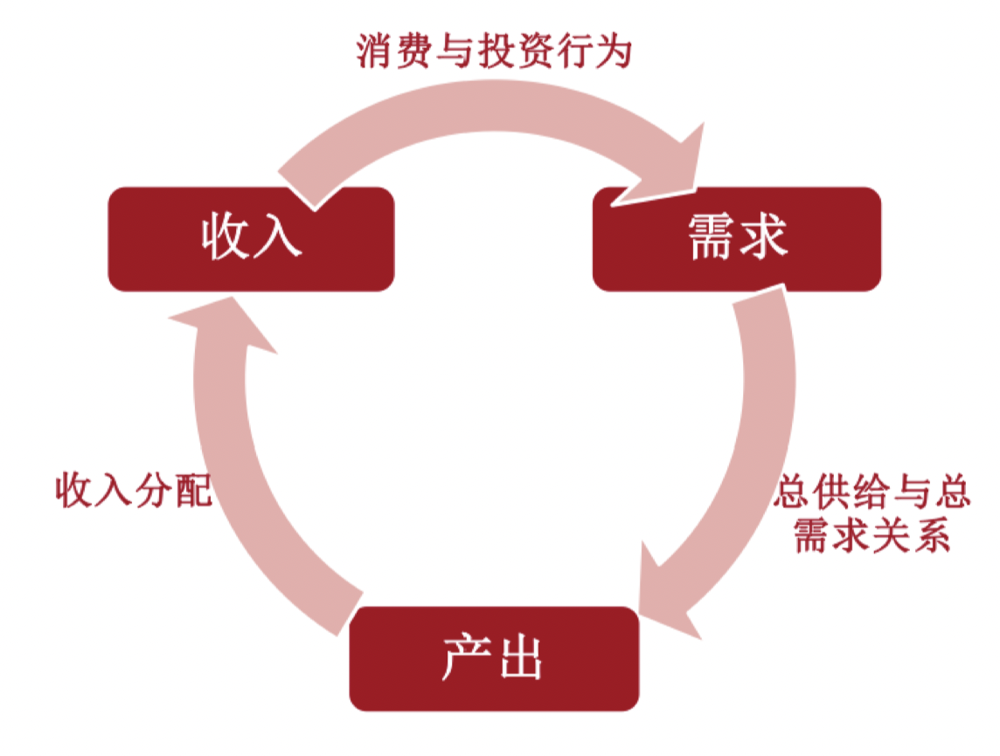

# 通过GDP认识中国经济

## 国民财富-->GDP

### 什么是国民财富？

### 为什么要关心国民财富？

### 为什么选择GDP？

## What is GDP?

1. GDP是**利用市场价格**来折算不同经济活动成果的总和（有价格，包含价值判断）
   GDP更低不一定代表着更低的福利/效用(**待补充公式推导**)
2. GDP是把所有能够**降低稀缺性**的劳动成果的总和（换句话说，GDP测量的是劳动所带来的{==**资源稀缺度的下降**==}）

!!! quote "中国国家统计局的GDP定义"
    GDP是指按^^市场价格^^计算的^^一个国家（或地区）^^所有^^常住单位^^在^^一定时期^^内^^生产活动^^的^^最终成果^^。

## 通过GDP认识中国经济

{: .callout width=400}

GDP的三种统计方法

## 初步探索中国经济的“消费不足”问题

## SP.中国统计数据的质量问题