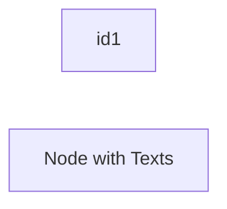
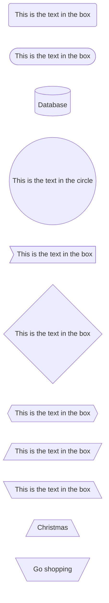
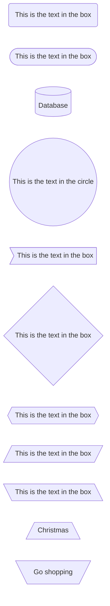
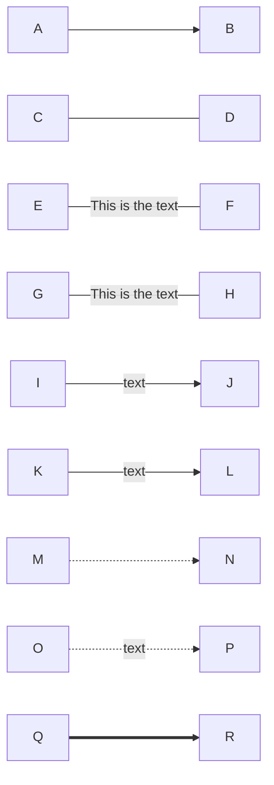
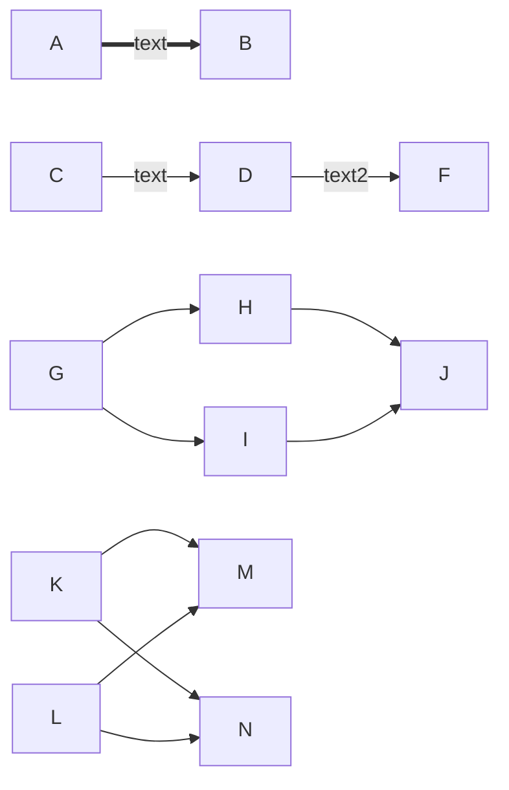
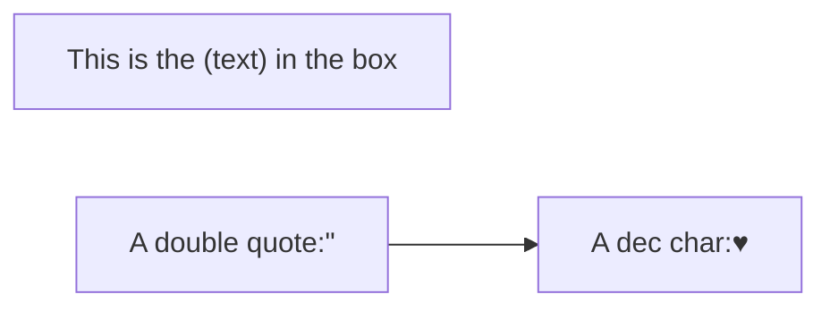
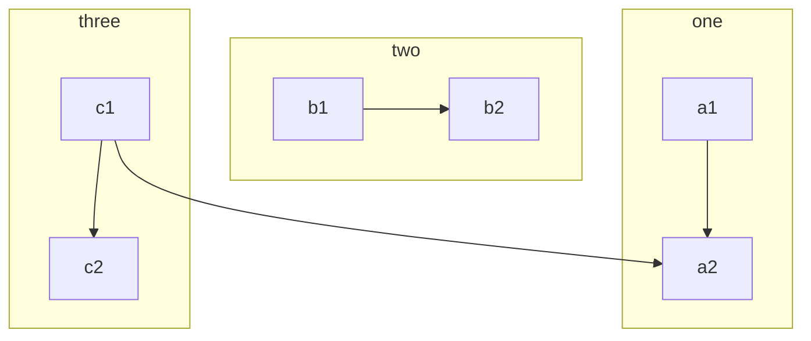
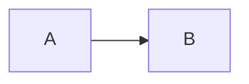

# Diagram Markdown

## Node & Shape


<!-- panels:start -->

<!-- div:title-panel -->

#### Default Node

<!-- div:left-panel -->

````markdown

````

<!-- div:right-panel -->


<!-- div:title-panel -->

#### Node with Different Styles

<!-- div:left-panel -->

````markdown

````

<!-- div:right-panel -->



<!-- div:title-panel -->

#### Links

<!-- div:left-panel -->

````markdown

````

<!-- div:right-panel -->


<!-- div:title-panel -->

#### Chains of Links

<!-- div:left-panel -->

````markdown

````

<!-- div:right-panel -->


<!-- div:title-panel -->

#### Special characters that break syntax(Should be avoided)

<!-- div:left-panel -->

````markdown

````

<!-- div:right-panel -->


<!-- div:title-panel -->

#### Subgraph

<!-- div:left-panel -->

````markdown
subgraph title
    graph definition
end
````

<!-- div:right-panel -->



<!-- div:title-panel -->

#### Interaction

<!-- div:left-panel -->

````markdown
# Function比较难，暂时没成功，触发链接的方式没问题


<script>
    var callback = function(){
        alert('A callback was triggered')
    }
<script>
````

<!-- div:right-panel -->


<!-- div:title-panel -->

#### Styling 待施工

<!-- panels:end -->
