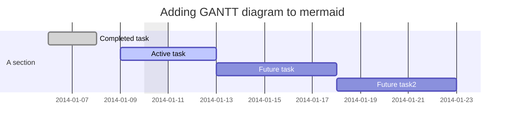
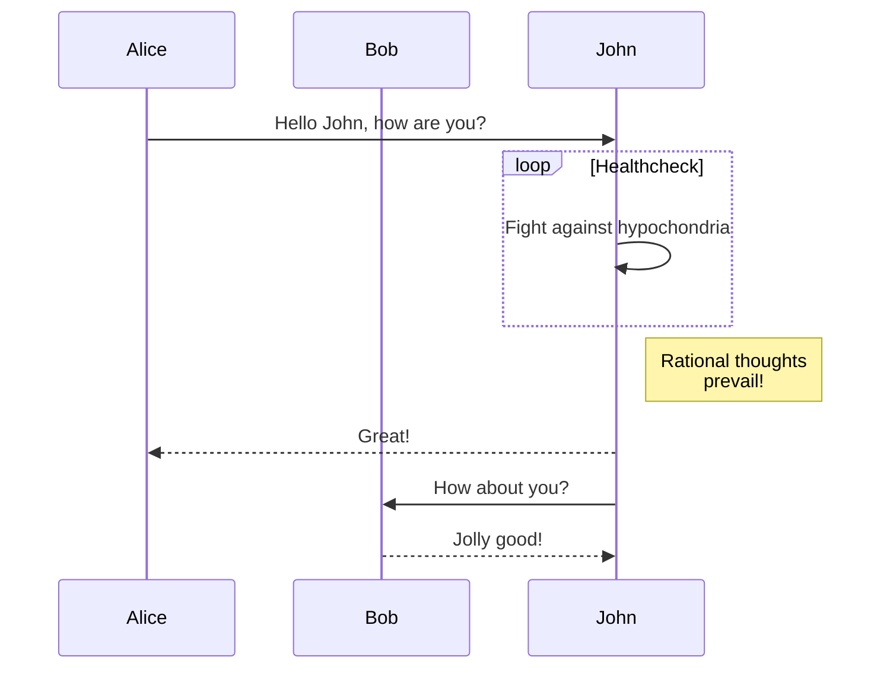

# MARKDOWN REFERENCE

<p align="right">更新日期：{docsify-updated}</p>
<!-- <p align="right"><font face ="微软雅黑">微软雅黑</font></p> -->
<!-- <div style="position: relative;"><div>这是一条新闻</div><div style="position: absolute; right: 0px; top: 0px;">2013-05-1</div></div> -->


## Headings

<!-- tabs:start -->

#### ** Rendered **

# Heading 1 {docsify-ignore}

Lorem ipsum dolor sit amet, consectetur adipiscing elit. Suspendisse luctus
nulla eu ex varius, a varius elit tincidunt. Aenean arcu magna, gravida id purus
a, interdum convallis turpis. Aenean id ipsum eu tortor sollicitudin scelerisque
in quis elit.

## Heading 2 {docsify-ignore}

Vestibulum lobortis laoreet nunc vel vulputate. In et augue non lectus
pellentesque molestie et ac justo. Sed sed turpis ut diam gravida sagittis nec
at neque. Vivamus id tellus est. Nam ac dignissim mi. Vestibulum nec sem
convallis, condimentum augue at, commodo diam.

### Heading 3 {docsify-ignore}

Suspendisse sit amet tincidunt nibh, ac interdum velit. Ut orci diam, dignissim
at enim sit amet, placerat rutrum magna. Mauris consectetur nibh eget sem
feugiat, sit amet congue quam laoreet. Curabitur sed massa metus.

#### Heading 4 {docsify-ignore}

Donec odio orci, facilisis ac vehicula in, vestibulum ut urna. Ut bibendum
ullamcorper risus, ac euismod leo maximus sed. In pulvinar sagittis rutrum.
Morbi quis cursus diam. Cras ac laoreet nulla, rhoncus sodales dui.

#### ** Markdown **

```markdown
# Heading 1

Lorem ipsum dolor sit amet, consectetur adipiscing elit. Suspendisse luctus
nulla eu ex varius, a varius elit tincidunt. Aenean arcu magna, gravida id purus
a, interdum convallis turpis. Aenean id ipsum eu tortor sollicitudin scelerisque
in quis elit.

## Heading 2

Vestibulum lobortis laoreet nunc vel vulputate. In et augue non lectus
pellentesque molestie et ac justo. Sed sed turpis ut diam gravida sagittis nec
at neque. Vivamus id tellus est. Nam ac dignissim mi. Vestibulum nec sem
convallis, condimentum augue at, commodo diam.

### Heading 3

Suspendisse sit amet tincidunt nibh, ac interdum velit. Ut orci diam, dignissim
at enim sit amet, placerat rutrum magna. Mauris consectetur nibh eget sem
feugiat, sit amet congue quam laoreet. Curabitur sed massa metus.

#### Heading 4

Donec odio orci, facilisis ac vehicula in, vestibulum ut urna. Ut bibendum
ullamcorper risus, ac euismod leo maximus sed. In pulvinar sagittis rutrum.
Morbi quis cursus diam. Cras ac laoreet nulla, rhoncus sodales dui.
```

<!-- tabs:end -->

## Text

<!-- tabs:start -->

#### ** Rendered **

Body text

**Bold text**

*Italic text*

~~Strikethrough~~

<mark>Marked text</mark>

<pre>Preformatted text</pre>

<small>Small Text</small>

This is <sub>subscript</sub>

This is <sup>superscript</sup>

#### ** Markdown **

```markdown
Body text

**Bold text**

*Italic text*

~~Strikethrough~~

<mark>Marked text</mark>

<pre>Preformatted text</pre>

<small>Small Text</small>

This is <sub>subscript</sub>

This is <sup>superscript</sup>
```

<!-- tabs:end -->

## Links

<!-- tabs:start -->

#### ** Rendered **

[Inline link](https://google.com)

[Inline link with title](https://google.com "Google")

[Reference link by name][link1]

[Reference link by number][1]

[Reference link by self]

[link1]: https://google.com
[1]: https://google.com
[Reference link by self]: https://google.com

#### ** Markdown **

```markdown
[Inline link](https://google.com)

[Inline link with title](https://google.com "Google")

[Reference link by name][link1]

[Reference link by number][1]

[Reference link by self]

[link1]: https://google.com
[1]: https://google.com
[Reference link by self]: https://google.com
```

<!-- tabs:end -->

## Lists

<!-- tabs:start -->

#### ** Rendered **

**Ordered Lists**

1. Ordered 1
1. Ordered 2
   1. Ordered 2a
   1. Ordered 2b
   1. Ordered 2c
1. Ordered 3

**Unordered Lists**

- Unordered 1
- Unordered 2
  - Unordered 2a
  - Unordered 2b
  - Unordered 2c
- Unordered 3

**Task Lists**

- [x] Task 1
- [ ] Task 2
  - [x] Subtask A
  - [ ] Subtask B
- [ ] Task 3

#### ** Markdown **

```markdown
**Ordered Lists**

1. Ordered 1
1. Ordered 2
   1. Ordered 2a
   1. Ordered 2b
   1. Ordered 2c
1. Ordered 3

**Unordered Lists**

- Unordered 1
- Unordered 2
  - Unordered 2a
  - Unordered 2b
  - Unordered 2c
- Unordered 3

**Task Lists**

- [x] Task 1
- [ ] Task 2
  - [x] Subtask A
  - [ ] Subtask B
- [ ] Task 3
```

<!-- tabs:end -->

## Blockquotes

<!-- tabs:start -->

#### ** Rendered **

> Cras aliquet nulla quis metus tincidunt, sed placerat enim cursus. Etiam
> turpis nisl, posuere eu condimentum ut, interdum a risus. Sed non luctus mi.
> Quisque malesuada risus sit amet tortor aliquet, a posuere ex iaculis. Vivamus
> ultrices enim dui, eleifend porttitor elit aliquet sed.
>
> *- Quote Source*

#### ** Markdown **

```markdown
> Cras aliquet nulla quis metus tincidunt, sed placerat enim cursus. Etiam
> turpis nisl, posuere eu condimentum ut, interdum a risus. Sed non luctus mi.
> Quisque malesuada risus sit amet tortor aliquet, a posuere ex iaculis. Vivamus
> ultrices enim dui, eleifend porttitor elit aliquet sed.
>
> *- Quote Source*
```

<!-- tabs:end -->

## Code

<!-- tabs:start -->

#### ** Rendered **

This is `inline code`

```javascript
const add   = (num1, num2) => num1 + num2;
const total = add(1, 2);

console.log(total); // 3
```

```html
<body>
    <p>Hello</p>
</body>
```

#### ** Markdown **

````markdown
This is `inline code`

```javascript
const add   = (num1, num2) => num1 + num2;
const total = add(1, 2);

console.log(total); // 3
```

```html
<body>
    <p>Hello</p>
</body>
```
````

<!-- tabs:end -->

## Notices

<!-- tabs:start -->

#### ** Rendered **

!> **Important** notice with `inline code` and additional placeholder text used
to force the content to wrap and span multiple lines.

?> **Tip** notice with `inline code` and additional placeholder text used to
force the content to wrap and span multiple lines.

#### ** Markdown **

```markdown
!> **Important** notice with `inline code` and additional placeholder text used
to force the content to wrap and span multiple lines.

?> **Tip** notice with `inline code` and additional placeholder text used to
force the content to wrap and span multiple lines.
```

<!-- tabs:end -->

## Tabs

Tabs provided via the
[docsify-tabs](https://jhildenbiddle.github.io/docsify-tabs) plugin.

<!-- tabs:start -->

#### **English**

Hello!

#### **French**

Bonjour!

#### **Italian**

Ciao!

#### ** Markdown **

```markdown
<!-- tabs:start -->

#### **English**

Hello!

#### **French**

Bonjour!

#### **Italian**

Ciao!

<!-- tabs:end -->
```

<!-- tabs:end -->

## Tables

<!-- tabs:start -->

#### ** Rendered **

| Left Align | Center Align | Right Align | Non&#8209;Breaking&nbsp;Header |
| ---------- |:------------:| -----------:| ------------------------------ |
| A1         | A2           | A3          | A4                             |
| B1         | B2           | B3          | B4                             |
| C1         | C2           | C3          | C4                             |

#### ** Markdown **

```markdown
| Left Align | Center Align | Right Align | Non&#8209;Breaking&nbsp;Header |
| ---------- |:------------:| -----------:| ------------------------------ |
| A1         | A2           | A3          | A4                             |
| B1         | B2           | B3          | B4                             |
| C1         | C2           | C3          | C4                             |
```

<!-- tabs:end -->

## Keyboard

<!-- tabs:start -->

#### ** Rendered **

<kbd>&uarr;</kbd> Arrow Up

<kbd>&darr;</kbd> Arrow Down

<kbd>&larr;</kbd> Arrow Left

<kbd>&rarr;</kbd> Arrow Right

<kbd>&#8682;</kbd> Caps Lock

<kbd>&#8984;</kbd> Command

<kbd>&#8963;</kbd> Control

<kbd>&#9003;</kbd> Delete

<kbd>&#8998;</kbd> Delete (Forward)

<kbd>&#8600;</kbd> End

<kbd>&#8996;</kbd> Enter

<kbd>&#9099;</kbd> Escape

<kbd>&#8598;</kbd> Home

<kbd>&#8670;</kbd> Page Up

<kbd>&#8671;</kbd> Page Down

<kbd>&#8997;</kbd> Option, Alt

<kbd>&#8629;</kbd> Return

<kbd>&#8679;</kbd> Shift

<kbd>&#9251;</kbd> Space

<kbd>&#8677;</kbd> Tab

<kbd>&#8676;</kbd> Tab + Shift

#### ** Markdown **

```markdown
<kbd>&uarr;</kbd> Arrow Up

<kbd>&darr;</kbd> Arrow Down

<kbd>&larr;</kbd> Arrow Left

<kbd>&rarr;</kbd> Arrow Right

<kbd>&#8682;</kbd> Caps Lock

<kbd>&#8984;</kbd> Command

<kbd>&#8963;</kbd> Control

<kbd>&#9003;</kbd> Delete

<kbd>&#8998;</kbd> Delete (Forward)

<kbd>&#8600;</kbd> End

<kbd>&#8996;</kbd> Enter

<kbd>&#9099;</kbd> Escape

<kbd>&#8598;</kbd> Home

<kbd>&#8670;</kbd> Page Up

<kbd>&#8671;</kbd> Page Down

<kbd>&#8997;</kbd> Option, Alt

<kbd>&#8629;</kbd> Return

<kbd>&#8679;</kbd> Shift

<kbd>&#9251;</kbd> Space

<kbd>&#8677;</kbd> Tab

<kbd>&#8676;</kbd> Tab + Shift
```

<!-- tabs:end -->

## Horizontal Rule

<!-- tabs:start -->

#### ** Rendered **

---

#### ** Markdown **

```markdown
---
```

<!-- tabs:end -->

## Images

<!-- tabs:start -->

#### ** Rendered **

Inline-style


Reference-style

![alt text][logo]

[logo]: //source.unsplash.com/collection/881815 "Provided by unsplash.com"

#### ** Markdown **

```markdown
**Inline**


**Reference**

![alt text][logo]

[logo]: //source.unsplash.com/collection/881815 "Provided by unsplash.com"
```

<!-- tabs:end -->

<!-- panels:start -->

<!-- div:title-panel -->

## Panel

<!-- div:left-panel -->

If you are on widescreen, checkout the right side panels.

<!-- div:right-panel -->

This panel is a demo. but you can see more in:

-   [Fairlay API](https://fairlay.com/api)

<small>please contact me if you use docsify-example-panels. i would like to display it here too.</small>

<!-- div:left-panel -->

1.  Define a panel in markdown file using `panel:start` and `panel:end` HTML comments.

    HTML comments are used to mark the start and end of a panel. The use of HTML comments prevents any markup from being displayed when markdown is rendered as HTML outside of your docsify site (e.g. Github, GitLab, etc).

<!-- div:right-panel -->

<p class='text-danger'> To avoid regex matches there's no whitespaces inside comment tag, beware when copying</p>

```markdown
<!--panels:start-->

(...) - Awesome div wrapper

<!--panels:end-->
```

<!-- div:left-panel -->

2.  Define divs within a panel in markdown file using HTML comments.

    The character sequence after double dot : will be rendered as the classname of the div content. all proceeding content will be associated with that div up to start of the next div `div:class` or end of panel `panel:end` comments.

<!-- div:right-panel -->

```markdown
<!--panels:start-->
<!--div:title-panel-->

  (...) - Awesome title
```

<!-- panels:end -->


## Alerts

<!-- tabs:start -->

#### ** Rendered **

> [!NOTE]
> An alert of type 'note' using global style 'callout'.

> [!NOTE|style:flat]
> An alert of type 'note' using alert specific style 'flat' which overrides global style 'callout'.

> [!TIP]
> An alert of type 'note' using global style 'callout'.

> [!WARNING|style:flat]
> An alert of type 'note' using alert specific style 'flat' which overrides global style 'callout'.

> [!DANGER|style:flat]
> An alert of type 'note' using alert specific style 'flat' which overrides global style 'callout'.

#### ** Markdown **

```markdown
> [!NOTE]
> An alert of type 'note' using global style 'callout'.

> [!NOTE|style:flat]
> An alert of type 'note' using alert specific style 'flat' which overrides global style 'callout'.
```

<!-- tabs:end -->

## PDF EMBED(NOT WOKRING)

<!-- tabs:start -->

#### ** Rendered **

<embed src="extra/pdf.pdf#page=2" type="application/pdf" width="100%" height="500px">

---

<iframe src="extra/pdf.pdf#page=2" width="100%" height="500px" style="border: none;">
This browser does not support PDFs. Please download the PDF to view it: 
<a href="extra/pdf.pdf#page=2">Download PDF</a></iframe>

---

<object data="extra/pdf.pdf#page=2" type="application/pdf" width="100%" height="500px" style="border: none;">
<p><b>Example fallback content</b>: This browser does not support PDFs. Please download the PDF to view it: 
<a href="extra/pdf.pdf">Download PDF</a>.</p>
</object>

#### ** Markdown **

```markdown

​<embed src="extra/pdf.pdf#page=2" type="application/pdf" width="100%" height="100%">

<object data="extra/pdf.pdf#page=2" type="application/pdf" width="100%" height="500px">
<p><b>Example fallback content</b>: This browser does not support PDFs. Please download the PDF to view it: 
<a href="extra/pdf.pdf">Download PDF</a>.</p>
</object>

```

<!-- tabs:end -->


<!-- panels:start -->

<!-- div:title-panel -->

## Diagrams

<!-- div:left-panel -->


<!-- div:right-panel -->

````markdown

````

<!-- panels:end -->





<!-- panels:start -->

<!-- div:title-panel -->

## Detail(Collapse Mode/Markdown in html tag)

<!-- div:left-panel -->

<details>
<summary>Self-assessment (Click to expand)</summary>

- Abc
- Abc

</details>

<!-- div:right-panel -->

````markdown
<details>
<summary>Self-assessment (Click to expand)</summary>

- Abc
- Abc

</details>
````

<!-- panels:end -->

​